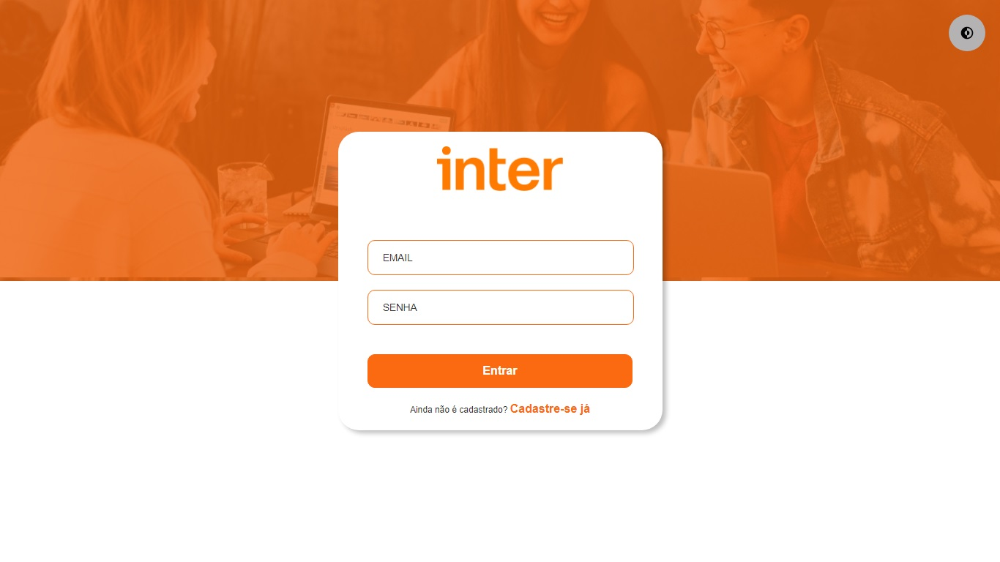
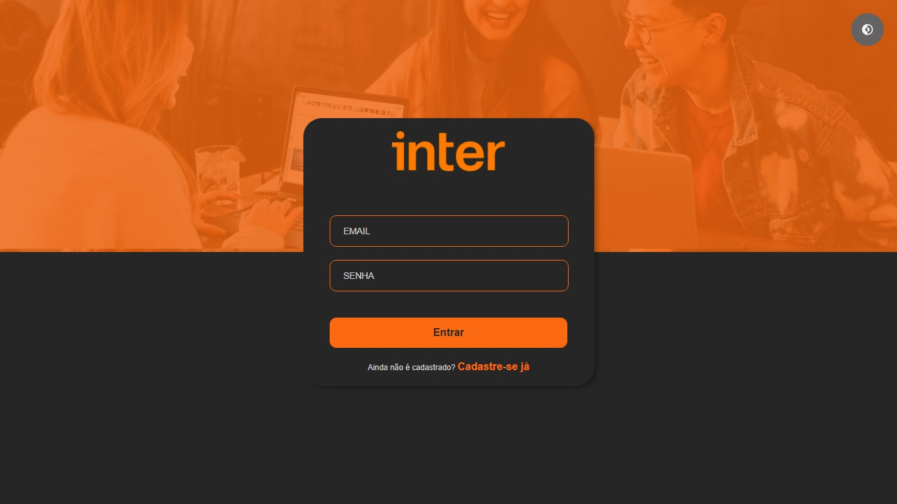
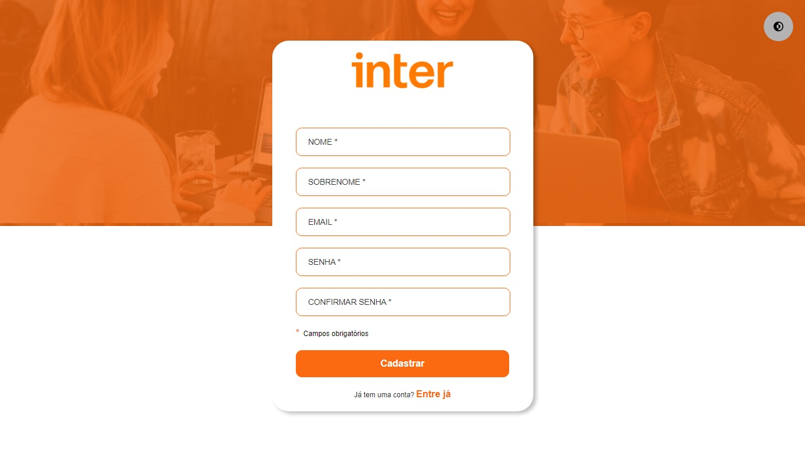
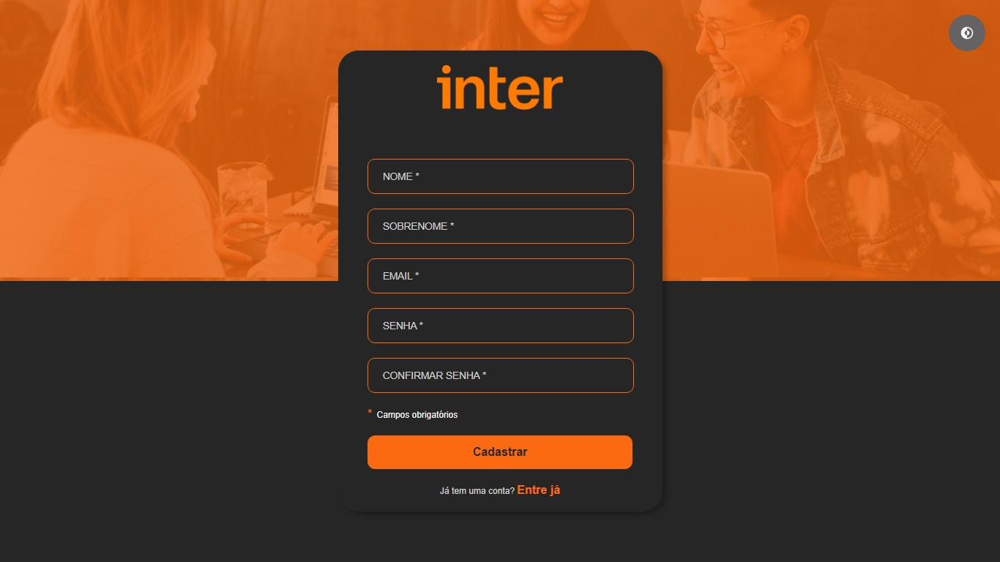
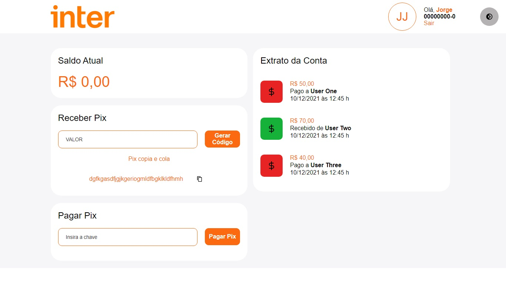
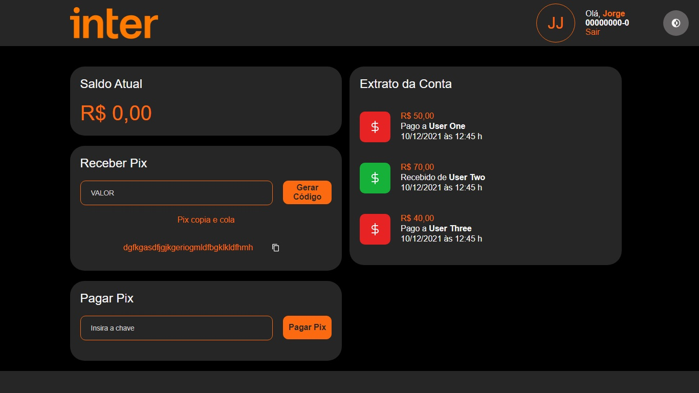
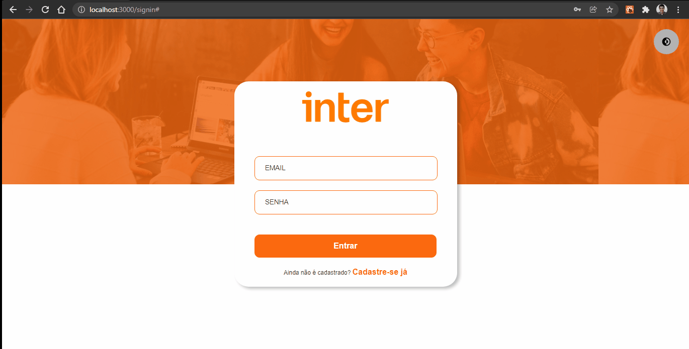

  

## Tecnologias utilizadas

Esse projeto foi desenvolvido utilizando as seguintes tecnologias:

- [React](https://reactjs.org/)
- [TypeScript](https://www.typescriptlang.org/)
- [Styled-Components](https://styled-components.com/)

## Sobre o Projeto

  Este projeto foi desenvolvido a partir do curso "Semana Inter Front-end Developer" promovido pelo [Banco Inter](https://www.bancointer.com.br/) em conjuto com a plataforma de ensino [Digital Innovation One](https://digitalinnovation.one/).
  
  É baseado Interface do Front-end da plataforma digital do Banco Inter, utilizando dados mockados para fins de visualização (Futuramente integrada com novo projeto em backend), desenvolvido a partir da ideia do instrutor do curso.
  
  O projeto conta com as 3 telas exibidas a seguir, utilizando navegação modelo SPA (Single Page Application), possui validação básica de campos obrigatórios tanto no login quanto no cadastro, apesar ded ainda não estar integrado com umaa regra de negócios a partir de um back-end, além da opção de alternância entre temas de exibição claro e escuro.

## Telas Reproduzidas

- Login de usuário
  
  
  

- Cadastro de usuário
  
  
  

- Painel de controle
  
  
  

## Demonstração da aplicação

  
